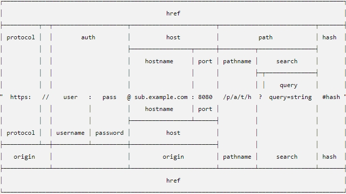

# node[express] 프로젝트 설정
## 1. 프로젝트 시작하기
```bash
git init 
git remote add origin 깃주소

# npm init -y를 실행하여 package.json을 생성
npm init -y

#생성된 package.json 파일의 script영역을 다음과 같이 수정한다.
"scripts": {
    "start" : "nodemon app"
  },
```

## 2. 프로젝트 환경 설정
```bash
npm i express			#Express -- frameWork 
npm i pug 				#View
npm i dotenv 			# node에서 환경변수들은 process.env에 저장되어 있고 거기에 원하는 변수를 등록할수 있게 도와주는 모듈
npm i mysql2 			#데이터베이스에 접속과 명령(쿼리)을 수행하는 모듈


npm i multer			#파일 업로드를 처리해주는 모듈
npm morgan				#logger(사용자가 서버에 접속하여 사용한 모든 행위를 기록)
```

## 3. 용어정리
1. ERP - Enterprise Resource Planning(전사적 자원 관리)
2. Deep(Marcine) Learning - AI를 위한 컴퓨터의 학습
3. Big Data 
4. AI - artificial intelligence(인공지능)
5. CRM - Customer RelationShip management
6. MRP - Meterial requirements planning(자재소요계획)


## 4. 웹용어
1. browser - Internet에 접속하기위한 Application
2. Application(App) - 응용프로그램
3. url - Uniform Resource Locator

	 

	 [URL 체계도 링크](https://nodejs.org/dist/latest-v12.x/docs/api/url.html)

4. href - hyperlink refernce
5. protocol - 규약/규칙
6. http - hyper text transfer protocal(port: 80)
7. https - hyper text transfer protocal secure(port: 443)
8. host - 컴퓨터의 IP/Domain
9. host - hostname: port(생략가능)